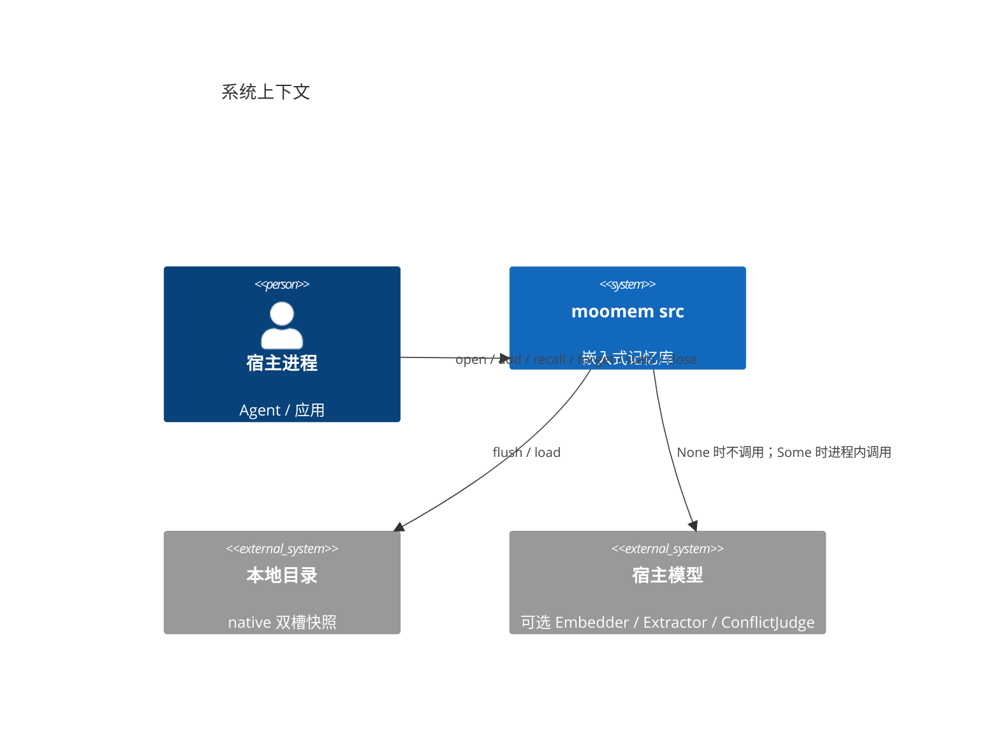
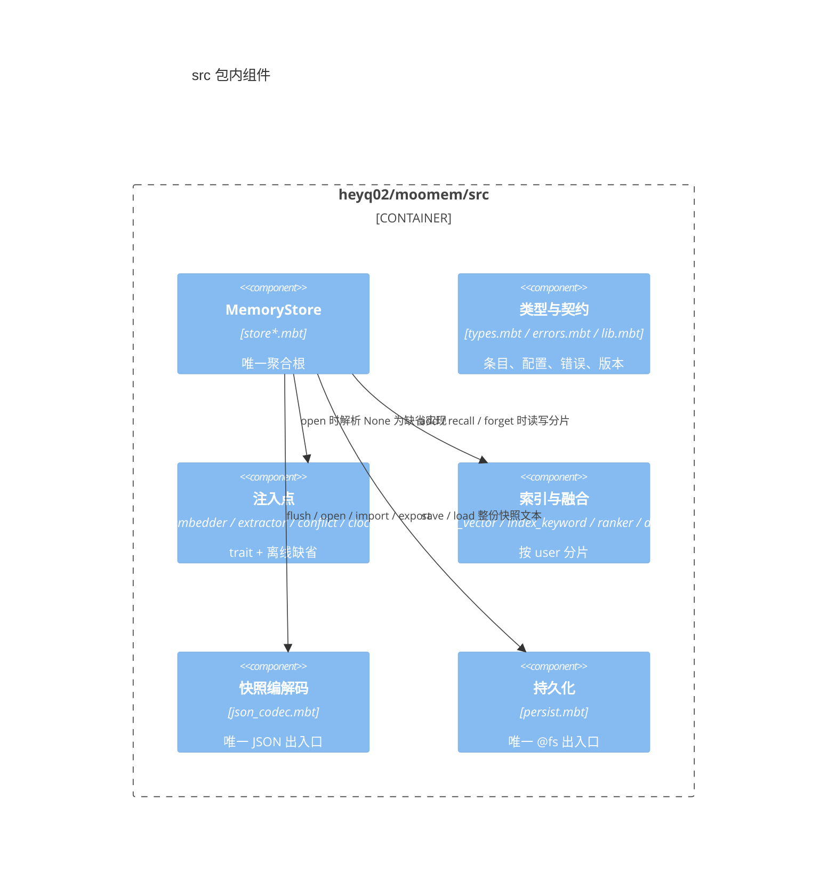
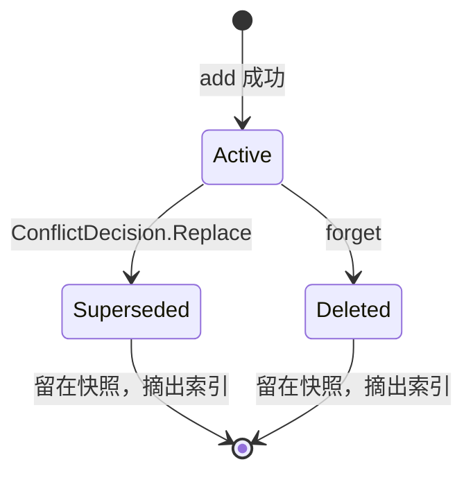
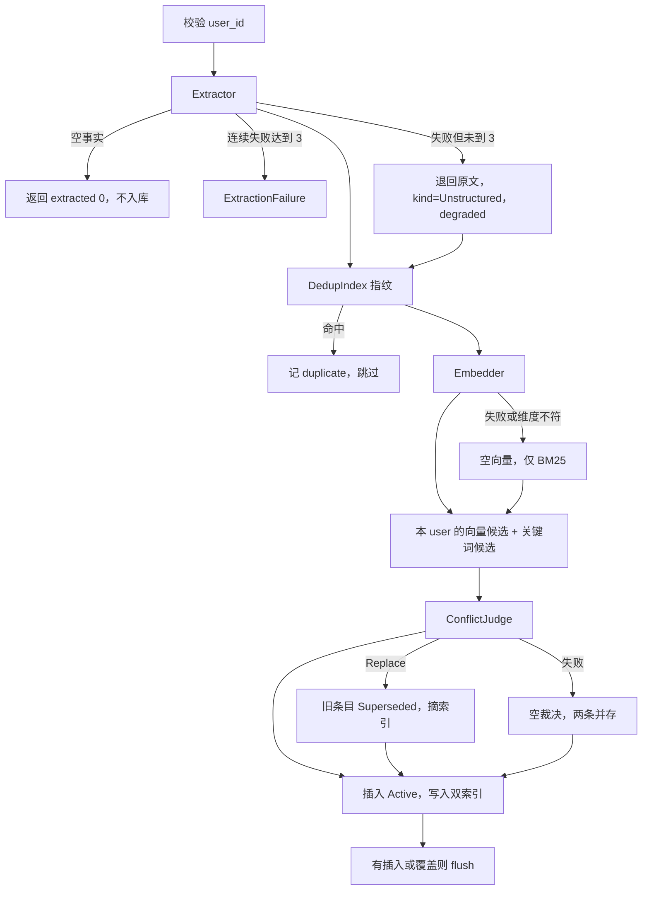

# moomem 架构蓝图

生成日期：2026-10-02。范围是核心库 `src/`（包 `heyq02/moomem`，版本 0.6.0）。宿主契约的短说明在 `README.md`；本文件描述 `src/` 里实际落地的结构，供以后改代码时保持同一条边界。

技术栈是 MoonBit，不是 Web 服务。依赖只有 `moonbitlang/core/json`、`moonbitlang/core/math`、`moonbitlang/x/fs`（`src/moon.pkg`）。没有 LLM SDK，没有网络客户端，没有第二个有状态门面。

## 1. 检测结论

| 项 | 实际形态 |
|----|----------|
| 形态 | 嵌入式库。宿主进程 `open` 一个 `MemoryStore`，在进程内 `add` / `recall` |
| 模式 | 单体聚合根。`MemoryStore` 是唯一有状态编排者；索引、去重、编解码、持久化都是它下面的无状态或可重建部件 |
| 后端 | native 缺省 `FsBackend`；wasm / js 缺省 `MemoryBackend`。差异只写在 `persist.mbt` 的 `#cfg` |
| 模型 | 宿主实现 `Embedder` / `Extractor` / `ConflictJudge`。缺省分别是 `HashingEmbedder`、`RawExtractor`、`SimilarityJudge`，全部离线、确定性 |

指导原则：

- 可失败操作返回 `Result[T, MoomemError]`，库路径不 panic。
- 快照是真相。内存索引在 `open` 时按快照重建，不单独持久化。
- 每个用户一块分片。检索必须带 `user_id`，没有全库召回。
- 文件系统调用只出现在 `persist.mbt`；JSON 编解码只出现在 `json_codec.mbt`。
- 不在库里带模型客户端。语义能力通过 trait 注入。

## 2. 总览



宿主看到的类型在 `lib.mbt` 点名：`MemoryStore` 的六个方法，加上 `export_jsonl` / `import_jsonl` / `list_entries`，五个注入 trait，以及 `MoomemError`。包内的 `VectorIndex`、`KeywordIndex`、`DedupIndex`、`rrf`、`tokenize`、快照编解码都不是宿主 API。

边界靠 MoonBit 可见性维持：未标 `pub` 的顶层定义只在包内可见。黑盒测试 `*_test.mbt` 只能看见 `pub`；白盒测试 `*_wbtest.mbt` 能看见包内符号。不要再导出一个 `IndexStore`。

## 3. 组件



| 组件 | 文件 | 职责 | 能否扩展 |
|------|------|------|----------|
| 聚合根 | `store.mbt`、`store_add.mbt`、`store_recall.mbt`、`store_records.mbt` | 类型、`open`、索引维护、`stats`、`close`、`flush`；`add`；`recall`；`forget` / 导入导出 / `list` | 新编排方法仍挂在 `MemoryStore` 上，不新建第二个聚合 |
| 类型 | `types.mbt`、`lib.mbt` | `MemoryEntry`、`Config`、摘要、统计、`validate_user_id`、版本常量 | 新公开字段进 `Config` / 条目；持久化字段同时改 `json_codec.mbt` |
| 错误 | `errors.mbt` | `MoomemError` 子错误，`message` / `kind` / `Show` | 新失败种类加变体，并补 `Show`、`message`、`kind` |
| 注入点 | `embedder.mbt`、`extractor.mbt`、`conflict.mbt`、`clock.mbt` | trait 与离线缺省 | 新能力做成新 trait，经 `Config` 在 `open` 里接上 |
| 索引 | `index_vector.mbt`、`index_keyword.mbt`、`ranker.mbt`、`dedup.mbt` | 暴力余弦、BM25、RRF、内容指纹 | 保持包内私有；分片键永远是 `user_id` |
| 编解码 | `json_codec.mbt` | 条目与快照 header 的唯一编码 | 不在其它文件写 `@json.parse` 或条目序列化 |
| 持久化 | `persist.mbt` | `PersistenceBackend`、`FsBackend`、`MemoryBackend` | 新的磁盘行为只加在这里 |

`store*.mbt` 是同一个类型的方法拆文件，不是四个服务。`add` 的阶段助手（提取、去重、嵌入、冲突、插入、flush）都是 `MemoryStore` 的私有方法。

## 4. 依赖方向

```text
宿主
  → MemoryStore
      → Embedder / Extractor / ConflictJudge / Clock / PersistenceBackend
      → VectorIndex / KeywordIndex / DedupIndex / ranker
      → json_codec
          → PersistenceBackend.save/load（文本，不含 JSON 库调用）
              → @fs   仅 FsBackend
```

允许的依赖是向内的：编排知道索引和编解码，索引不知道 `MemoryStore`。`moon.pkg` 可以 import `x/fs`，但非测试核心代码里只有 `persist.mbt` 可以调用它。`persist_test.mbt` 是磁盘测试的允许名单。

没有循环门面。`HashingEmbedder` 与 `KeywordIndex` 共用 `tokenize`，这是同一分词器的复用，不是第二套检索入口。

## 5. 数据

### 条目

`MemoryEntry` 是一条记忆。身份是 `"{seq 12 位 hex}-{内容哈希 4 位 hex}"`，由 `generate_entry_id` 生成，不含 `user_id`。`seq` 在恢复后续接，不复用。`created_at` 来自注入的 `Clock`，不是系统时间。

| 字段 | 作用 |
|------|------|
| `status` | `Active` / `Superseded` / `Deleted` / `Unstructured`。`recall` 只返回 `is_recallable` 为真的状态：`Active` 与 `Unstructured` |
| `kind` | `Fact` / `Preference` / `Event` / `Unstructured`。缺省提取把原文标成 `Unstructured` |
| `embedding` | 长度等于 `config.dim`。嵌入失败时为空数组，该条只走关键词 |
| `keywords` | 写入时分好的 token，恢复时不重算 |
| `superseded_by` | `Replace` 时写下新条目 id |
| `metadata` | `extractor`、`extraction_degraded`、`embedding_degraded`、冲突备注等 |

`add` 插入时状态是 `Active`。`kind = Unstructured` 表示原文直通或提取降级，不等于状态机进了 `Unstructured`。状态 `Unstructured` 仍可被召回，主要用于导入或恢复进来的条目。



其余迁移没有公开 API。关闭后的调用返回 `InvalidOperation`。

### 快照

真相是一份完整 JSONL，不是追加日志。

```text
<path>/moomem/slot0.jsonl
<path>/moomem/slot1.jsonl
<path>/moomem/head          "0" 或 "1"
```

首行 header：`{"v":1,"gen":…,"clock":…}`。`v` 必须等于 `SNAPSHOT_VERSION`（1）。其后每行一条 `MemoryEntry`。尾部半行丢弃并计入 `truncated_recovered`；中部坏行使整份快照 `StoreCorrupted`。

`flush` 把全部条目（含已覆盖、已删除）按 `seq` 排序后覆盖写入非当前槽，成功后再写 `head`。写槽中途崩溃时 `head` 仍指向旧槽。写 `head` 中途崩溃时，选择能解析且 `gen` 更大的槽。

### 索引

三类结构都按 `user_id` 分片，存在 `MemoryStore` 的私有字段里：

- `VectorIndex`：该用户向量的暴力余弦。查询向量为空或余弦为 0 的条目不返回。
- `KeywordIndex`：BM25。`tokenize` 对 CJK 出单字和相邻二元组，对拉丁字母数字出小写词。
- `DedupIndex`：内容指纹。规范化会去首尾空白、小写、去掉「用户的 / 用户 / 我的 / 我」前缀和尾部标点。

`open` 只把可召回条目重新灌入索引。被覆盖和被删除的行留在 `entries` 里，供 `list_entries` 和导出审计。

### 校验

`validate_user_id` 是唯一实现，`add` / `recall` / `forget` / `list_entries` / 导入都走它。规则：非空、长度不超过 64、字符集 `[A-Za-z0-9_\-.]`、拒绝 `"."` 和 `".."`、拒绝路径分隔符和空白。

## 6. 两条主路径

### add



缺省 `SimilarityJudge` 用余弦和关键词 Jaccard 的较大值。大于等于 `supersede_threshold`（0.82）为 `Replace`；落在阈值下方 `coexist_band`（0.15）内为 `Coexist`；更低则不产生裁决。它不理解「我搬到深圳了」这种改写，要覆盖旧事实需要宿主自己的 `ConflictJudge`。

### recall

必须带 `user_id`。查询先嵌入；嵌入失败则该路为空，只剩 BM25。

缺省融合是 `AdaptiveLexical`：

1. 用 BM25 的 top1 与 top2 判断词法是否强（`lexical_floor`、`lexical_gap`）。
2. 词法强且 `vector_weight_when_lexical` ≤ 0.05 时，结果就是 BM25 的前 `k` 条。
3. 否则按当前权重做加权 RRF。词法强用 `vector_weight_when_lexical`（缺省 0.05），否则用 `vector_weight_when_semantic`（缺省 0.45）。
4. `protect_bm25_topk` 保证 BM25 的前 `k` 名仍在结果里。

`EqualRrf` 是等权 RRF，用来回退。`top_k` 缺省 5，上限 50。已有命中但不足 `top_k` 时，`BackfillRecency` 按插入序从新到旧补齐；零命中不编造结果。`NoBackfill` 关闭补齐。

## 7. 横切

| 关注点 | 库里的做法 |
|--------|------------|
| 认证与权限 | 没有。隔离单位是调用方传入的 `user_id`，不是账号体系 |
| 错误 | `MoomemError`：`InvalidUserId`、`StoreCorrupted`、`IoFailure`、`ExtractionFailure`、`EmbeddingFailure`、`BackendUnsupported`、`InvalidOperation`。`message` 给人看，`kind` 给元数据 |
| 降级 | 提取失败在连续 3 次之前退回原文；嵌入失败变关键词检索；冲突判定失败则不覆盖、两条并存。第 3 次提取失败返回 `ExtractionFailure` |
| 日志与监控 | 没有日志框架。可观察的是 `AddSummary.notes`、`metadata`、`StoreStats` |
| 校验 | `validate_user_id` 加上 `open` 时对 `Config` 数值范围的检查 |
| 配置 | `Config` 的注入点都是 `Option`。`None` 使用离线缺省。融合权重和阈值写在 `Config` 常量里 |
| 密钥 | 核心库不读环境变量，不保存 API key |
| 时间 | `LogicalClock` 单调递增；`FixedClock` 用于测试。核心库不读系统时钟 |
| 并发 | 单写者。没有内部锁；宿主不要并发调用同一个 `MemoryStore` |

## 8. 通信

没有服务发现、没有 RPC、没有 API 版本协商。组件之间是同包函数调用和 trait 对象。

对外的「协议」只有两处：

- 方法签名：`MemoryStore` 与五个 trait。
- 磁盘格式：快照 `v = 1`。格式版本 `SNAPSHOT_VERSION` 与包版本 `MOOMEM_VERSION` 分开。改快照字段要同时改 `json_codec.mbt` 并维持 `v`。

导入导出使用同一套 JSONL 行，但是宿主之间的文本交换，不是网络 API。非法 `user_id` 和坏行在导入时跳过并计数，不把半份数据写成成功。

## 9. MoonBit 包内惯例

- 一个目录一个包。`src/*.mbt` 共享命名空间，测试辅助类型不能重名，所以用 `Store*`、`Config*`、`Adversarial*`、`Conflict*` 前缀。
- `pub(open) trait` 的方法写成 `self : Self`，宿主在包外实现。
- `pub(all)` 用来让枚举构造器和条目前往包外可见。`AddSummary`、`StoreStats` 是 `pub struct`，黑盒测试不能自行构造。
- 目标差异只用 `#cfg`，并且只放在 `persist.mbt` 的缺省后端选择。
- 错误在内部可以用 `raise MoomemError`，公开方法收成 `Result`。

未检测到 .NET、Java、React、Angular 或 Python 运行时结构。`package.json` 只用于本地覆盖率命令，不是库的运行时。

## 10. 实现模式

**注入。** `open` 读 `Config`。`persistence`、`embedder`、`extractor`、`judge`、`clock` 为 `None` 时分别变成 `default_backend(path)`、`HashingEmbedder`、`RawExtractor`、`SimilarityJudge`、`LogicalClock`。解析之后存在 `MemoryStore` 上，不再更换。

**缺省嵌入。** `tokenize` → 每个 token 用 FNV-1a 落到 `dim` 个桶（缺省 256）→ 桶内词频 → L2 归一。相同文本余弦为 1；词集合不相交时余弦为 0，检索时被丢掉。这不是神经网络。

**阶段助手。** `store_add.mbt` 把 `add` 拆成提取、清零连续失败、去重、嵌入、收集候选、判定、插入、应用 `Replace`、按需 flush。公开的 `add` 只做编排。

**软删除与覆盖。** 两者都调用 `deindex_entry`：从向量索引、关键词索引和去重表摘掉，行仍留在 `entries`。`forget` 把状态改成 `Deleted`。`Replace` 把状态改成 `Superseded` 并写下 `superseded_by`。

**恢复。** `load` 得到文本后 `parse_snapshot_text`，然后 `restore_entries` 重建 `by_user`、`next_seq`、`clock_high` 和三个索引。

## 11. 测试

| 层 | 位置 | 看见什么 |
|----|------|----------|
| 黑盒 | `src/*_test.mbt`，跟在对应源文件旁 | 只有 `pub` |
| 白盒 | `src/*_wbtest.mbt` | 包内索引、编解码、RRF、Jaccard |
| 崩溃注入 | `persist.mbt` 内的测试 | `MemoryBackend` 的失败与半写开关是包内私有的，所以测试留在这个文件 |
| 端到端 | `store_test.mbt`、`adversarial_test.mbt`、`config_test.mbt` | 重启一致、跨用户隔离、覆盖、降级、导入导出、配置边界 |

断言用 `inspect`。替身是手写的 trait 实现，没有 mock 框架。native 用例数不得低于 76。`src/` 的覆盖率点不得低于 90%（`moon coverage report -f summary -p heyq02/moomem/src`）。磁盘用例只在 native 编译。

`tests/locomo` 是离线语料评测，不是包旁单元测试。

## 12. 部署

库本身不部署。宿主把包链进 native、wasm、wasm-gc 或 js 程序。

| 目标 | 缺省持久化 | 数据在哪 |
|------|------------|----------|
| native | `FsBackend` | `<path>/moomem/` 两个槽加 `head` |
| wasm / js | `MemoryBackend` | 进程内存。要跨会话就由宿主实现 `PersistenceBackend` |

没有容器编排，没有环境配置文件，没有功能开关服务。行为由 `Config` 和编译目标决定。

## 13. 扩展

**加一种模型能力。** 在 `embedder.mbt` / `extractor.mbt` / `conflict.mbt` / `clock.mbt` 旁边新增 trait 文件，给一个离线缺省实现，把 `Option` 放进 `Config`，在 `MemoryStore::open` 里解析。不要在核心包里接具体厂商 SDK。

**改检索融合。** 改 `ranker.mbt` 和 `store_recall.mbt`，旋钮放在 `Config`。不要为此拆出第二个 `MemoryStore`。

**改磁盘格式。** 只改 `json_codec.mbt` 与 `SNAPSHOT_VERSION`。`persist.mbt` 继续只搬运整段文本。

**改用户隔离。** 新的查询路径必须接收 `user_id`，并且只查该用户的分片。

不要做的事：在 `persist.mbt` 以外的非测试核心代码调用 `@fs`；在 `json_codec.mbt` 以外解析条目 JSON；把 `VectorIndex` 重新标成 `pub` 当作宿主 API；在库内恢复已删除的命令行或内置模型客户端。

## 14. 模式示例

注入点在 `open` 时从 `None` 落到缺省实现（`store.mbt`）：

```moonbit
let embedder : &Embedder = match cfg.embedder {
  Some(e) => e
  None =>
    match HashingEmbedder::new(cfg.dim) {
      Ok(h) => h as &Embedder
      Err(e) => return Err(e)
    }
}
```

可召回条目才进入索引（`store.mbt` 的 `restore_entries`）：

```moonbit
if e.is_recallable() {
  self.index_entry(e)
}
```

维度不一致时不进向量索引，关键词索引仍然写入（`index_entry`）：

```moonbit
if e.embedding.length() == self.dim {
  self.vector_index.upsert(e.user_id, e.id, e.embedding)
}
self.keyword_index.upsert(e.user_id, e.id, e.keywords)
```

## 15. 已经体现在代码里的决定

| 决定 | 原因 | 后果 |
|------|------|------|
| 一个 `MemoryStore`，索引不公开 | 宿主只需要记和查；公开索引会变成第二套 API | 换索引算法不用改宿主签名。调试索引要写白盒测试 |
| 快照整份覆盖，双槽加 `head` | 追加 JSONL 在崩溃时难以判断哪一段有效 | 写入量随条目数增长。崩溃后要么旧槽完整，要么按更大的 `gen` 回退 |
| 缺省嵌入是哈希，不是神经网络 | 库必须离线、可单测、三端一致 | 字面不相交的句子余弦为 0。「搬家」不会自动覆盖旧住址 |
| 冲突判定可注入，缺省只看相似度 | 语义更新规则属于宿主的模型 | 默认 `SimilarityJudge` 的阈值是 0.82，共存带 0.15 |
| 提取连续失败 3 次才报错 | 短暂失败不应弄丢记忆 | 失败时先以原文入库并在 `notes` / `metadata` 标明降级 |
| `user_id` 物理分片 | 跨用户泄漏不能靠调用方记得过滤 | 每个检索 API 都要 `user_id`。`stats` 是唯一的全库视图，且不含正文检索 |
| 方法拆到 `store_add` / `store_recall` / `store_records` | `store.mbt` 过长 | 类型仍然只有一个。新方法按阶段放进对应文件 |

## 16. 怎样保持这条边界

- 包旁测试：`moon test`。native 通过数不得低于 76。
- `src/` 覆盖率：`moon coverage report -f summary -p heyq02/moomem/src`，不得低于 90%。push / PR 上的 Coveralls job 会再查一次。
- 文件该放哪，以 `.trellis/spec/library/directory-structure.md` 为准。公开表面以 `.trellis/spec/library/public-api-and-types.md` 为准。
- 发版时让 `src/lib.mbt` 的 `MOOMEM_VERSION` 与 `moon.mod` 的 `version` 一致。`SNAPSHOT_VERSION` 只在快照格式变化时增加。

## 17. 加功能时从哪下手

| 想加什么 | 先改哪里 | 然后 |
|----------|----------|------|
| 新的记忆字段 | `types.mbt` 的 `MemoryEntry` | `json_codec.mbt` 往返，再加白盒测试 |
| 新的配置旋钮 | `Config` 与 `Config::default` | `open` 里校验并拷到 `MemoryStore` |
| 新的失败种类 | `errors.mbt` 三个出口：`Show`、`message`、`kind` | `errors_test.mbt` |
| 宿主提供的新能力 | 新的 trait 文件 | `Config` 的 `Option`，`open` 的缺省分支 |
| `add` 或 `recall` 的新阶段 | 对应的 `store_*.mbt` 私有方法 | 黑盒测试走 `MemoryStore`，不要直接测私有阶段，除非要钉住包内不变量 |
| 崩溃行为 | `persist.mbt` | 优先用 `MemoryBackend` 注入失败，而不是真磁盘 |

常见偏差：为了图方便在 `store_add.mbt` 里直接读文件；让 `recall` 在没传 `user_id` 时搜索全部用户；把哈希嵌入换成会联网的默认实现；为融合策略再造一个公开的检索类型。

架构变化时更新本文件里的组件表、两条主路径和「已经体现在代码里的决定」。不要把评测分数或某一次任务的验收编号写进这里。
