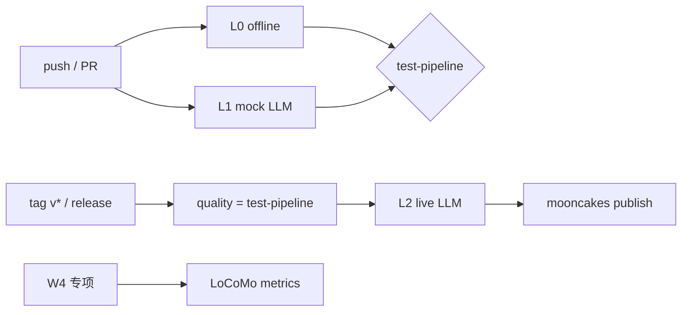

# moomem 测试用例体系(2026-10-01)

> **落点 / CI / 决策树（架构权威）** → [10-testing-examples-architecture](10-testing-examples-architecture.md)。本文只做 L0–L3 **用例编目与 AC 映射**；能力边界与目标目录以 10 为准。

对照 [04-progress-and-roadmap](04-progress-and-roadmap.md) 与 [PRD v1.1](03-prd.md)（FR-01~10 / AC-01~07），把现有与发版门禁测试收成**四层体系**。目标：日常 CI 零网络全绿；发版必须过真实 LLM；W4 LoCoMo 指标另册。

## 0. 分层一览

| 层 | 名称 | 触发 | 网络 / Key | 入口 | 门禁作用 |
|----|------|------|------------|------|----------|
| **L0** | 纯工程离线 | 每次 push/PR → `test-pipeline` | 无 | `moon test`（四后端）+ `moon check` | 阻塞合并 |
| **L1** | Mock LLM | 同 L0（包内 `*_test.mbt`） | 无（脚本化 Provider） | `src/llm_extractor/*_test.mbt` | 阻塞合并 |
| **L2** | Live LLM | **仅** `release-pipeline` | 要（DeepSeek） | `moon run ci/llm_live --target native` | **阻塞发版** |
| **L3** | 基准评测 | push/PR → `eval-locomo`（离线）；api/live 手工 | 离线零密钥；api/live 可选 | `moon run ci/locomo --target native` | 离线阻塞合并；api/live 不进 push CI |



**铁律**：L0/L1 永不读取 `DEEPSEEK_*`；L2 永不并入 push CI。

---

## 1. 验收映射（AC → 层）

| AC | 摘要 | L0 | L1 | L2 | L3 |
|----|------|----|----|----|-----|
| AC-01 持久化重启一致 | MemoryBackend / FsBackend reopen | ✅ `store_e2e` / `persist_test` | — | 可选（MemoryBackend 会话内） | — |
| AC-02 跨用户 0 渗透 | 分片 + QA 规模隔离 | ✅ `store_e2e` / `qa_adversarial` / `index_test` | — | ✅ 双用户 live | 跨用户 0 渗透指标 |
| AC-03 闲聊过滤 + 事实提取 | Raw 不滤闲聊（预期）；LLM 滤 | 空白 chitchat | ✅ mock 提取/集成 | ✅ 多句闲聊 + 混合句 | Precision≥0.8 |
| AC-04 冲突 supersede | 确定性 judge / LLM judge | ✅ AlwaysReplace + embedder mock | ✅ replace 端到端 | ✅ 住址更正（共享词召回候选） | supersede≥80% |
| AC-05 降级 | 失败 Extractor / Provider | ✅ | ✅ ReturnRaw / PropagateError | —（真网失败偶发不作为绿路径） | — |
| AC-06 多后端 | wasm / wasm-gc / js / native | ✅ CI matrix | ✅ 同跑 | native only | — |
| AC-07 赛事六条 | 证据链 | README+测试+CI | metadata 可解释 | live 日志 | 评测报告 |

---

## 2. L0 · 纯工程离线（无 LLM）

包路径均在 `src/`（+ `src/cli`）。`moon test --target native` = **115**；wasm 系跳过 `#cfg(native)` 磁盘/CLI = **102**。（W3 前为 97/90；W3.1 后 112/99；W4 后 114/101；指纹归一化加固后 115/102）

### 2.1 类型 / 编解码 / user_id — `types_test.mbt`

| ID | 用例 | 覆盖 |
|----|------|------|
| L0-T01 | legal ids / 64 边界 / 非法拒绝 | FR-04 入口校验 |
| L0-T02 | MemoryEntry JSON 往返 | FR-08 基础 |
| L0-T03 | superseded_by 往返 | 状态机可序列化 |
| L0-T04 | snapshot build/parse；version mismatch；中段损坏/尾截断 | FR-01/05 |

### 2.2 嵌入 / 分词 / 判定 / 去重 — `extractor_test.mbt`

| ID | 用例 | 覆盖 |
|----|------|------|
| L0-E01~03 | HashingEmbedder 确定性 / dim / 余弦 | Q1 可注入、离线嵌入 |
| L0-E04 | cosine 正交/平行 | 检索 primitive |
| L0-E05 | CJK tokenize | BM25 分词 |
| L0-E06 | RawExtractor unstructured 直通 | 缺省提取（**不**做 AC-03 闲聊过滤） |
| L0-E07 | LogicalClock / FixedClock | 可测时间 |
| L0-E08~09 | SimilarityJudge 分档 + Jaccard | AC-04 规则路径 |
| L0-E10 | DedupIndex per-user | FR-02 去重 |

### 2.3 索引 / RRF — `index_test.mbt`

| ID | 用例 | 覆盖 |
|----|------|------|
| L0-I01~02 | VectorIndex 隔离 / remove | FR-03/04 |
| L0-I03~04 | KeywordIndex CJK + BM25 排序 | FR-03 |
| L0-I05~06 | RRF 融合 / top_k | FR-03 |

### 2.4 持久化 — `persist_test.mbt`

| ID | 用例 | 覆盖 |
|----|------|------|
| L0-P01~02 | MemoryBackend roundtrip / IoFailure | FR-05 抽象 |
| L0-P03 | 半行截断恢复 | FR-05 崩溃 |
| L0-P04~06 | FsBackend reopen / head 损坏 / 尾截断（**native only**） | AC-01 磁盘 |

### 2.5 Store 端到端 — `store_e2e_test.mbt`

| ID | 用例 | 覆盖 |
|----|------|------|
| L0-S01 | AC-01 MemoryBackend 重启 | AC-01 |
| L0-S02 | AC-02 零泄漏 | AC-02 |
| L0-S03 | AC-04 AlwaysReplace + topic embedder | AC-04 |
| L0-S04 | AC-05 失败提取降级 | AC-05 |
| L0-S05 | 空白不入库 | FR-02 |
| L0-S06 | 精确去重 | FR-02 |
| L0-S07 | forget 软删 | FR-06 |
| L0-S08 | recall 空 / top_k | FR-03 |
| L0-S09 | FixedClock | 可解释时间 |
| L0-S10 | closed 拒绝操作 | 生命周期 |
| L0-S11 | export/import 等价 | FR-08 |
| L0-S12 | stats 一致性 | 可观测 |

### 2.6 QA 对抗 — `qa_adversarial_test.mbt`

边界/规模/导入健壮性（top_k、55+ 条、supersede 链、fingerprint、超长条目、config、clock、user_id 入口、import 损坏行与非法 user_id、dedup 重叠等）——全部 **L0**。

### 2.7 CLI — `cli/cli_wbtest.mbt`（native 侧重）

| ID | 用例 | 覆盖 |
|----|------|------|
| L0-C01~04 | `--all` 位置、标准选项、非法选项 | FR-07 |

### 2.8 示例冒烟（CI 清单；非包旁 L0）

> 角色属 **E2 example**（教学演示 / smoke），**不是**包旁 `*_test.mbt`。落点与迁移后四场景见 [10](10-testing-examples-architecture.md)。此处仅编目现网 CI 冒烟入口。

| ID | 入口 | 覆盖 |
|----|------|------|
| EX-X01 | `moon run examples --target native` | mock Provider 演示，零网络（现状单包；目标 `examples/<scene>`） |

---

## 3. L1 · Mock LLM（无网络，可合并门禁）

包：`src/llm_extractor/`。Provider 为包内脚本化 mock，**不** import `mizchi/llm/openai`。

### 3.1 契约单测 — `llm_extractor_test.mbt`

| 主题 | 代表用例 |
|------|----------|
| 提取 | 事实+闲聊、纯闲聊空数组、围栏 JSON、噪声 JSON、非法重试、未知 kind、max_facts、空白零调用 |
| 降级 | ReturnRaw / 网络失败不重试 / PropagateError→store 可见 |
| Judge | 无候选零调用、replace/coexist/ignore、非法重试、失败并存 |
| 集成 | store 闲聊不入库 + `metadata.extractor=llm`；replace→supersede 状态机 |

### 3.2 QA 对抗 — `qa_w2_adversarial_test.mbt`

截断、空 content、流 Error 时序、静默空响应、DegradePolicy 可见性差异、judge 重复 id / 大小写 / 未知 id 重试等。

---

## 4. L2 · Live LLM（真实 DeepSeek，仅发版）

| 项 | 值 |
|----|-----|
| 代码 | `ci/llm_live/` |
| 命令 | `moon run ci/llm_live --target native` |
| 密钥 | Secret `DEEPSEEK_API_KEY`；Variables `DEEPSEEK_BASE_URL` / `DEEPSEEK_MODEL` |
| 成功标记 | 日志行 `LIVE_LLM_PASS` |
| Workflow | `.github/workflows/release-pipeline.yml` → job `llm-live` |

### 4.1 场景清单（实现于 `ci/llm_live/main.mbt`）

| ID | 场景 | 断言要点（抗非确定性） |
|----|------|------------------------|
| L2-01 | 多句纯闲聊 | 每句 `extracted=0 && inserted=0` |
| L2-02 | 空白/纯空格 | 零入库、尽量零调用 |
| L2-03 | 寒暄+事实混合句 | `extracted≥1`，内容含过敏/花生等 |
| L2-04 | 偏好 / 事件类表述 | 至少入库 1 条；kind 可为 Preference/Event/Fact |
| L2-05 | metadata / stats | `extractor_mode` 含 llm；条目 metadata 可解释 |
| L2-06 | 召回 | query「花生过敏」hits≥1 |
| L2-07 | 冲突更正（同 user，共享关键词） | 新住址可召回；若 `superseded≥1` 则旧址不可 recall |
| L2-08 | 近重复去重 | 第二次相同语义：`duplicates≥1` / `inserted=0` / `superseded≥1` 任一成立，且 Active 中关键事实 ≤1 |
| L2-09 | 跨用户隔离 | A 的事实不会出现在 B 的 recall |
| L2-10 | forget 软删 | forget 后 recall 不回；list 仍可见 Deleted |
| L2-11 | export 非空 | 有记忆时 export_jsonl 非空 |
| L2-12 | 调用预算观测 | `extractor.llm_call_count()≥1`；成功路径无残留 failure |

本地：

```bash
set -a && source .env && set +a
moon run ci/llm_live --target native
```

---

## 5. L3 · W4 评测（已实现）

| 项 | 值 |
|----|-----|
| 代码 | `ci/locomo/` |
| 离线命令 | `moon run ci/locomo --target native` → `LOCOMO_PASS` |
| 数据 | `ci/locomo/data/`（LoCoMo 子集 CC BY-NC 4.0；勿改） |
| CI | `test-pipeline.yml` → job `eval-locomo`（`needs: test`） |

| 用例 ID | 场景 | 离线断言 |
|---------|------|----------|
| L3-R01 | Hybrid vs BM25-only Recall@5 / MRR@5（+ NoBackfill 对照） | 出表；hashing 下不强制 hybrid≥bm25 / 15%（`TARGET_15PCT` 仅 `--embedder api`） |
| L3-C01 | 近重复 supersede（20 组） | 正确率 ≥80% |
| L3-C02 | 语义冲突（10 组） | 只记录 cos/jac/status |
| L3-P01 | 磁盘 reopen id 集合一致 | 1/1 |
| L3-I01 | 跨 user 渗透 | 0 |
| L3-E01 | 提取 Precision | 离线 SKIP；`--live` 时 ≥0.8（DeepSeek） |

| 指标（PRD §16） | 目标 | 离线实测（hashing, 2026-10-01） |
|-----------------|------|----------------------------------|
| 混合检索 Recall@5 vs 单路 BM25 | 增益 ≥15%（需真实嵌入） | Hybrid 0.335 vs BM25 0.435（−23%；api 档另测） |
| 提取 Precision | ≥0.8 | SKIPPED（`--live`） |
| supersede 正确率 | ≥80% | 19/20 = 0.950 |
| 跨用户渗透 | 0 | 0 |

---

## 6. CI / 发版接线

| Workflow | 跑哪些层 |
|----------|----------|
| `test-pipeline.yml` | L0 + L1（四后端）+ examples 冒烟 + **L3 离线** `eval-locomo` |
| `release-pipeline.yml` | 调用 test-pipeline → **L2** → publish |

规格：[spec-process-cicd-test-pipeline](../../spec/spec-process-cicd-test-pipeline.md)、[spec-process-cicd-release-pipeline](../../spec/spec-process-cicd-release-pipeline.md)。

---

## 7. 缺口与演进

| 项 | 状态 | 建议 |
|----|------|------|
| L0/L1 现网 115/102 | ✅ | 现网计数（W3 增量：配置用例 6、CLI 用例 4；W3.1 增量：TC-A1~A5、TC-C4/C5；W4-0 增量：闲聊清零 2；指纹归一化增量：DedupIndex 主语/标点同指纹 1）；新增用例同步改本表 ID |
| L2 场景从冒烟扩为矩阵 | ✅（本轮实现） | 发版必跑；失败不降级为 skip |
| L3 LoCoMo | ✅ | `ci/locomo` + `eval-locomo`；08 报告待产品侧 |
| CLI 真 LLM 接线 | ✅ W3-C 已接线（`--llm`，native 门控） | L0 覆盖参数解析与配置构造；真实调用归 L2 |
| 缺省冲突判定的语义档缺口 | ⚠️ 已实测记录 | 缺省 SimilarityJudge 仅覆盖近重复式更新（住址式实测 0.471→Ignore）；语义档由 L2-07 覆盖，见 README 限制第 4 条 |
| 代理环境下的传输失败分类 | ⚠️ 环境依赖 | `HTTP_PROXY` 生效时无 `StreamEvent::Error`，落回 `invalid JSON` + 多 1 次调用；见 README 限制第 10 条 |
| hashing 混合检索低于 BM25 | ⚠️ 预期内 | 无语义嵌入时 RRF 噪声；质量主张走 `--embedder api` |
| AC-03 在 Raw 路径 | 设计如此不过滤 | 文档已声明；勿当 bug |

---

## 8. 变更记录

| 日期 | 变更 |
|------|------|
| 2026-10-01 | 初版：四层体系 + AC 映射 + 现有用例编目；L2 扩场景与发版门禁对齐 |
| 2026-10-01 | W3.1：L1 增 TC-A1~A3（ReturnRaw 可观测）；L0 增 TC-A4/A5；CLI 增 TC-C4/C5（localhost 精确匹配） |
| 2026-10-01 | W4：L3 `ci/locomo` 离线 harness + `eval-locomo` CI；W4-0 闲聊清零计数；native 112→114 |
| 2026-10-01 | 指纹归一化加固（0eee88c，随 docs 重组混入）：`normalize_content` 剥主语前缀（用户的/用户/我的/我）与尾标点，吸收 LLM 提取措辞漂移；judge prompt 增补「语义等价复述判 replace」；native 114→115 |
| 2026-10-01 | W3.1-C：`StreamEvent::Error` 原因统一 `transport error:` 前缀；解析失败保留 `invalid JSON:`（断言最小修补） |
| 2026-10-01 | W3.1 独立复验：112/99×3 与全部 DoD 复现；新增两项 P3 残留（代理环境传输失败分类、闲聊不清零计数），见 [07 报告](07-w3.1-verification.md) |
| 2026-10-01 | 文首回链 [10](10-testing-examples-architecture.md)；§2.8 示例冒烟标明 E2（EX-X01），避免与包旁 L0 混淆 |
