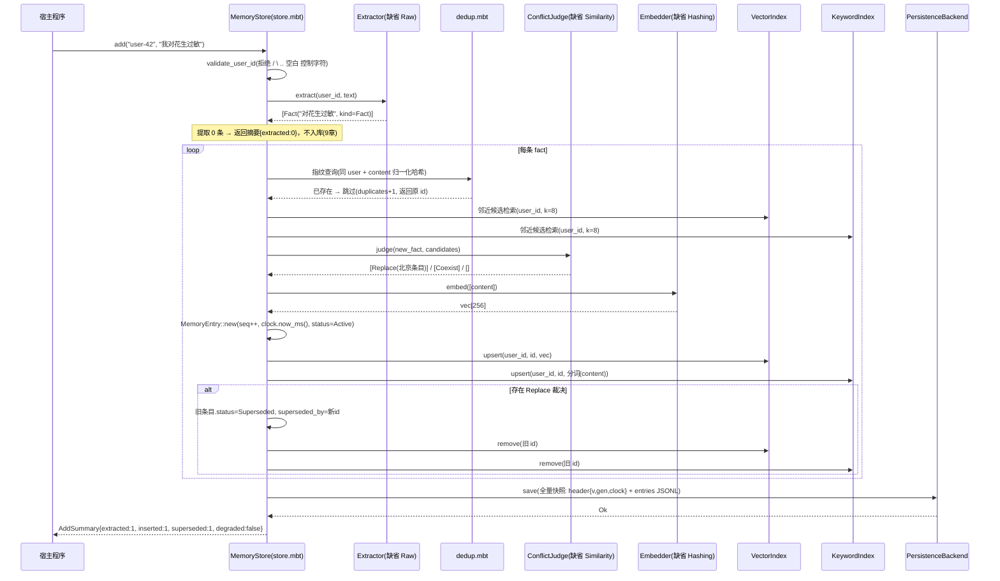
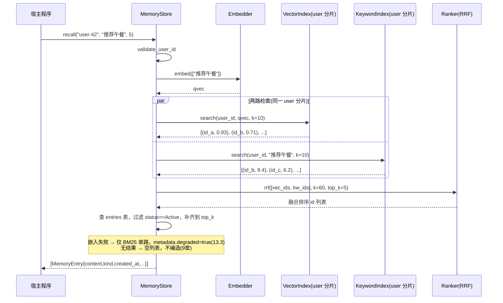
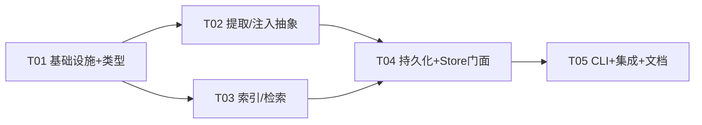

# moomem 系统架构设计 v1.0

> 产品：moomem —— MoonBit 嵌入式 Agent 记忆层库
> 依据：moomem-PRD-v1.0（含 v1.1 决议 Q1/Q2）
> 架构师：Bob ｜ 状态：待工程团队评审
> 工具链基线：moon 0.1.20260920（已实测本机 ~/.moon/bin/moon）

---

## 1. 实现方案与模块划分

### 1.1 核心技术挑战

| 挑战 | 说明 | 对策 |
|------|------|------|
| C1 无网络/无 Key 的可测试闭环 | W1 必须纯工程可验证，本地无 LLM API Key | 所有 AI 能力（嵌入、提取、冲突判定）抽为一等注入 trait，缺省实现全部确定性、离线 |
| C2 MoonBit 标准库无文件系统 | `moonbitlang/core` 实测**没有 fs 模块**（本机核对），FR-05 磁盘持久化无法用纯 core 实现 | 引入官方 `moonbitlang/x/fs`（唯一依赖），所有 fs 调用隔离在 `persist.mbt` 适配层（呼应 PRD RK-03 对策） |
| C3 x/fs 无 append / rename API | 只有整文件读写（`write_string_to_file` 覆盖式），PRD 的"追加写 JSONL"无法直接实现 | 改用**双槽快照 + head 指针**崩溃安全方案（见 1.4），语义仍满足 FR-05"恢复到最后一次完整写入" |
| C4 标准库无时钟 | core 无 time 模块，`created_at` 无来源 | 注入 `Clock` trait；缺省 `LogicalClock`（持久化的单调计数器），测试确定性，生产可注入系统时钟 |
| C5 跨用户隔离的结构性保证 | FR-04 要求"跨用户检索结构上不可能" | 索引按 user_id 物理分片（HashMap[user_id, Index]），检索入口强制带 user_id，无全库接口 |
| C6 三后端一致（wasm-gc/js/native） | FR-09 | 纯计算逻辑三后端天然一致；存储后端按 PRD 第 15 章适配表降级（非 native 默认 MemoryBackend，可注入宿主持久化适配） |

### 1.2 总体架构：零第三方依赖 + 三trait 注入

采纳主理人建议的"零外部依赖可运行"策略，并做一处修正：

- **核心库只依赖 `moonbitlang/x/fs`（官方 moonbitlang 出品，实验性）**。理由：core 无 fs，不引入它则 FR-05/FR-01 无法实现；若坚持绝对零依赖，唯一方案是持久化整体外置为宿主注入（`PersistenceBackend` trait），"两行代码接入"的体验即被破坏。折中：**fs 依赖被锁死在 `persist.mbt` 单一适配层内**，x/fs 若发生破坏性变更（RK-03），更换成本为一个文件。
- **不引入 vcdb / MoonRetrieve / mizchi/llm**（三者 API 均未验证，风险登记在案）。它们的能力以三个 trait 注入点对接：
  - `Embedder`（Q1 决议：一等注入 trait）——缺省 `HashingEmbedder`（确定性词袋哈希嵌入，256 维，TF 归一）；生产注入 vcdb 适配实现。
  - `Extractor`——缺省 `RawExtractor`（raw 直通：原文以 kind=unstructured 入库，即 PRD 的 raw 模式）；生产注入 mizchi/llm 适配实现。
  - `ConflictJudge`——缺省 `SimilarityJudge`（嵌入余弦 + 关键词重叠的规则判定，阈值可配）；生产注入 LLM 判定（PRD 13.2 的 replace/merge/ignore）。
- **BM25 关键词检索内置精简实现**（PRD 第 14 章已授权），含 CJK 单字 + 二元组分词器。RRF 融合器内置。
- **冲突覆盖、去重、状态机**全部为纯本地确定性逻辑，W1 即可完整验收 AC-01/02/04/05。

### 1.3 模块划分（与 PRD 第 6 章对应）

```
┌───────────────────────────────────────────────────┐
│ API 层      store.mbt      open/add/recall/forget/  │
│                            stats/close（编排一切） │
├───────────────────────────────────────────────────┤
│ 提取层      extractor.mbt(Embedder 也在此层注入)   │
│             conflict.mbt   dedup.mbt               │
├───────────────────────────────────────────────────┤
│ 索引层      index_vector.mbt(内存余弦近邻)         │
│             index_keyword.mbt(内置BM25) ranker.mbt │
├───────────────────────────────────────────────────┤
│ 存储层      persist.mbt    PersistenceBackend trait│
│             (FsBackend / MemoryBackend)           │
├───────────────────────────────────────────────────┤
│ 工具层      cli/main.mbt   add/recall/list/stats/  │
│                            export/import           │
└───────────────────────────────────────────────────┘
公共：types.mbt / errors.mbt / json_codec.mbt / lib.mbt
```

设计原则：**MemoryStore 是唯一有状态编排者**（聚合根），其余模块均为无状态或可重建组件；索引与条目表均常驻内存，持久化仅负责快照落盘——单写者模型（PRD 第 15 章）下这是最简正确方案。

### 1.4 持久化方案：双槽快照 + head 指针（对 PRD 的有意偏差）

PRD 6/15 章原文为"追加写 JSONL"。`moonbitlang/x/fs` 实测 API（write_string_to_file 覆盖式、read_file_to_string、path_exists、create_dir、remove_file，**无 append、无 rename**），追加日志无法实现。替代方案：

- 库内条目全量常驻内存；每次 `add`/`forget` 完成后（或 close 时）触发一次 **flush = 全量重写快照**。
- 磁盘布局（MemoryStore.path 目录）：
  ```
  <path>/moomem/
    slot0.jsonl   # 快照槽 A：每行一个 MemoryEntry 的 JSON
    slot1.jsonl   # 快照槽 B
    head          # 内容 "0" 或 "1"，指向当前有效槽
  ```
- flush 流程：写**非当前槽**（完整写入）→ 成功后写 head（内容仅 1 字节，实践上近原子）。写槽中途崩溃 → head 仍指向旧槽，数据无损；写 head 中途崩溃 → head 内容为空/损坏时回退"取能完整解析且 gen 更大的槽"。
- 每行一个 JSON；**文件首行为 header**：`{"v":1,"gen":<递增代数>,"clock":<逻辑时钟>}`。恢复时逐行解析，尾部不完整行（半行损坏）直接丢弃并计入 `truncated_recovered`（PRD 15 章边缘场景）。
- 复杂度：O(条目数) 每次 flush。万级条目、单条 ~300B 时快照 ~3MB，v0.1 可接受；README 性能章节明示（PRD 15 章"大量写入"场景），v0.2 候选：native 侧 extern C 追加写 / x/fs 出 append API 后切回日志追加。

### 1.5 三后端策略（FR-09）

- native：FsBackend（x/fs），完整磁盘持久化。
- wasm-gc / js：缺省 MemoryBackend（进程内），同时 `open` 接受注入的 `PersistenceBackend`（宿主可接浏览器 IndexedDB 胶水，即 x/fs 的 `__moonbit_fs_unstable` extern 适配）。此为 PRD 第 15 章"wasm 后端存储路径映射到持久化 API"的落地方式，后端差异**只在 persist.mbt**，检索/状态机/融合行为三后端一致。

---

## 2. 文件列表

> 与仓库 0.2.2 树对齐（2026-10-01 复核）。改代码时的包/层约定见 `.trellis/spec/library/`。

```
moomem/
├── moon.mod                   # 模块定义 heyq02/moomem@0.2.2；deps: moonbitlang/x, mizchi/llm（cli/llm_extractor）
├── README.md                  # 快速上手 + 性能 + 安全边界（15分钟跑通场景A）
├── docs/                      # PARA 结构（对齐 FlowUs）；路由见 docs/README.md
│   ├── README.md              # 文档总索引 + where-to-look
│   ├── project/               # 项目主体叙事：架构 / PRD / 进度 / 测试 / 验证 / 评测 / 交接
│   │   ├── architecture.md    # 本文档
│   │   ├── class-diagram.mermaid
│   │   ├── sequence-diagram-add.mermaid
│   │   ├── sequence-diagram-recall.mermaid
│   │   └── 03~10 编号报告（测试/示例架构权威 = 10）
│   ├── resources/             # 调研与立项依据（选题/竞品）
│   └── archive/               # 归档；含 feature-specs/（已完成 W3/W3.1/W4 规格）
├── spec/                      # 现行 process 契约（CI·发布流水线）— 非 Trellis 编码规范
├── .trellis/spec/             # AI 编码约定（改 src/ 前读 library/）
├── examples/                  # E2 场景演示（mock / 零网络）；见 [10](10-testing-examples-architecture.md)
│   ├── basic-store/
│   ├── llm-extractor/
│   ├── conflict-supersede/
│   └── cli-smoke/
├── ci/                        # 角色子树（gates / eval / tools）；见文档 10
│   ├── gates/
│   │   └── live-llm/          # L2 Live LLM 门禁（发版流水线）
│   ├── eval/
│   │   └── locomo/            # L3 LoCoMo 评测 harness（含 data/）
│   └── tools/
│       └── retrieval-tuning/  # 离线调参台（不进 CI）
├── src/                       # 核心库（13 个非测试 .mbt）
│   ├── moon.pkg               # 核心库包配置（import moonbitlang/x/fs；调用点仍须隔离在 persist.mbt）
│   ├── lib.mbt                # 公开常量、MOOMEM_VERSION / SNAPSHOT_VERSION
│   ├── types.mbt              # 核心类型：EntryStatus/EntryKind/MemoryEntry/Config/StoreStats/AddSummary/...
│   ├── errors.mbt             # MoomemError 统一错误
│   ├── json_codec.mbt         # 各类型 to_json/from_json（唯一 JSON 编解码处）
│   ├── embedder.mbt           # trait Embedder + HashingEmbedder + cosine_similarity
│   ├── clock.mbt              # trait Clock + LogicalClock + FixedClock
│   ├── extractor.mbt          # trait Extractor + RawExtractor(缺省)
│   ├── conflict.mbt           # trait ConflictJudge + SimilarityJudge(缺省) + ConflictDecision
│   ├── dedup.mbt              # 精确去重（同 user 内容指纹）
│   ├── index_vector.mbt       # 每 user 分片的余弦近邻索引
│   ├── index_keyword.mbt      # 每 user 分片的内置 BM25 + CJK 分词器
│   ├── ranker.mbt             # RRF 融合
│   ├── persist.mbt            # trait PersistenceBackend + FsBackend + MemoryBackend（双槽快照；核心唯一 @fs 调用点）
│   ├── store.mbt              # MemoryStore：open/add/recall/forget/stats/close 编排
│   ├── types_test.mbt         # 黑盒：编解码 / validate_user_id
│   ├── index_test.mbt         # 黑盒：双索引 / RRF / BM25 / 分片隔离
│   ├── extractor_test.mbt     # 黑盒：注入点 / raw 模式
│   ├── persist_test.mbt       # 黑盒：双槽 / head 损坏 / MemoryBackend 崩溃注入
│   ├── store_e2e_test.mbt     # 黑盒：AC-01~05 端到端
│   ├── qa_adversarial_test.mbt
│   ├── w3_config_test.mbt     # Config 校验 / W3 相关
│   ├── llm_extractor/         # 可选 LLM 适配包（核心零 mizchi/llm）
│   │   ├── moon.pkg
│   │   ├── llm_extractor.mbt  # LlmExtractor
│   │   ├── llm_judge.mbt      # LlmConflictJudge
│   │   ├── prompts.mbt
│   │   ├── llm_extractor_test.mbt
│   │   └── qa_w2_adversarial_test.mbt
│   └── cli/                   # native CLI（is-main）
│       ├── moon.pkg           # targets：native 编译 llm_wiring.mbt，非 native 用 stub
│       ├── main.mbt           # CLI：add/recall/list/stats/export/import
│       ├── llm_wiring.mbt     # native：--llm / --llm-judge 接线
│       ├── llm_wiring_stub.mbt
│       └── cli_wbtest.mbt
```

---

## 3. 核心数据结构与接口（Mermaid + 代码级描述）

### 3.1 类图

```mermaid
classDiagram
    class MemoryStore {
        +String path
        +Config config
        -HashMap~String,MemoryEntry~ entries
        -HashMap~String,Array~String~~ by_user
        -VectorIndex vec_index
        -KeywordIndex kw_index
        -PersistenceBackend persistence
        -Clock clock
        -Int gen
        -Int64 logical_clock
        +open(path, config?) Result~MemoryStore,MoomemError~
        +add(user_id, text) Result~AddSummary,MoomemError~
        +recall(user_id, query, top_k?) Result~Array~MemoryEntry~,MoomemError~
        +forget(user_id, target) Result~Int,MoomemError~
        +stats() Result~StoreStats,MoomemError~
        +close() Result~Unit,MoomemError~
        -flush() Result~Unit,MoomemError~
        -validate_user_id(user_id) Result~Unit,MoomemError~
    }
    class Config {
        +Embedder? embedder
        +Extractor? extractor
        +ConflictJudge? judge
        +PersistenceBackend? persistence
        +Int dim
        +Int rrf_k
        +Int recall_candidates
        +Double supersede_threshold
    }
    class MemoryEntry {
        +String id
        +String user_id
        +String content
        +EntryKind kind
        +Array~Double~ embedding
        +Array~String~ keywords
        +EntryStatus status
        +Int64 created_at
        +String? superseded_by
        +Int seq
        +Map~String,JsonValue~ metadata
    }
    class EntryStatus {
        <<enumeration>>
        Active
        Superseded
        Deleted
        Unstructured
    }
    class EntryKind {
        <<enumeration>>
        Fact
        Preference
        Event
        Unstructured
    }
    class AddSummary {
        +Int extracted
        +Int inserted
        +Int duplicates
        +Int superseded
        +Bool degraded
        +Array~String~ notes
    }
    class StoreStats {
        +Int total/active/superseded/deleted/unstructured
        +Int64 bytes_on_disk
        +Int64? last_write_at
        +Int truncated_recovered
    }
    class Embedder {
        <<trait>>
        +embed(texts Array~String~) Result~Array~Array~Double~~,MoomemError~
        +dim() Int
    }
    class HashingEmbedder {
        +Int dim
    }
    class Extractor {
        <<trait>>
        +extract(user_id, text) Result~Array~ExtractedFact~,MoomemError~
        +mode() String
    }
    class RawExtractor
    class ExtractedFact {
        +String content
        +EntryKind kind
        +String? source_span
    }
    class ConflictJudge {
        <<trait>>
        +judge(new_fact, candidates Array~MemoryEntry~) Result~Array~ConflictVerdict~,MoomemError~
    }
    class SimilarityJudge {
        +Double threshold
    }
    class ConflictVerdict {
        +MemoryEntry existing
        +ConflictDecision decision
    }
    class ConflictDecision {
        <<enumeration>>
        Replace
        Coexist
        Ignore
    }
    class PersistenceBackend {
        <<trait>>
        +load() Result~String?,MoomemError~
        +save(snapshot String) Result~Unit,MoomemError~
    }
    class FsBackend {
        +String dir_path
        +Int slot
    }
    class MemoryBackend {
        -String? snapshot
    }
    class Clock {
        <<trait>> 
        +now_ms() Int64
    }
    class VectorIndex {
        -HashMap~String, Array~(String, Array~Double~~)~ shards
        +upsert(user_id, id, vec)
        +remove(user_id, id)
        +search(user_id, qvec, k) Array~(String,Double)~
    }
    class KeywordIndex {
        -HashMap~String, Bm25Shard~ shards
        +upsert(user_id, id, keywords)
        +remove(user_id, id)
        +search(user_id, query, k) Array~(String,Double)~
    }
    class Ranker {
        +rrf(lists Array~Array~String~~, k Int, top_k Int) Array~String~
    }
    class MoomemError {
        <<enumeration>>
        InvalidUserId(String)
        StoreCorrupted(String)
        IoFailure(String)
        ExtractionFailure(String)
        EmbeddingFailure(String)
        BackendUnsupported(String)
        InvalidOperation(String)
    }

    MemoryStore *-- Config : 组合
    MemoryStore *-- "N" MemoryEntry : 持有(entries)
    MemoryStore o-- Embedder : 注入(缺省 HashingEmbedder)
    MemoryStore o-- Extractor : 注入(缺省 RawExtractor)
    MemoryStore o-- ConflictJudge : 注入(缺省 SimilarityJudge)
    MemoryStore o-- PersistenceBackend : 注入(缺省按后端选择)
    MemoryStore o-- Clock : 注入(缺省 LogicalClock)
    MemoryStore *-- VectorIndex : 组合
    MemoryStore *-- KeywordIndex : 组合
    HashingEmbedder ..|> Embedder : 实现
    RawExtractor ..|> Extractor : 实现
    SimilarityJudge ..|> ConflictJudge : 实现
    FsBackend ..|> PersistenceBackend : 实现(native)
    MemoryBackend ..|> PersistenceBackend : 实现(测试/wasm)
    MemoryEntry *-- EntryStatus
    MemoryEntry *-- EntryKind
    ConflictVerdict *-- MemoryEntry
    ConflictVerdict *-- ConflictDecision
    ExtractedFact *-- EntryKind
    Ranker ..> MemoryEntry : 按 id 排序引用
```



### 3.2 MoonBit 代码级描述（接口签名）

> 以下为代码级约定，具体语法以工程实现时 moon 0.1.20260920 编译通过为准（trait 方法首个参数为 `self`，错误统一 `Result[T, MoomemError]`）。

```moonbit
// ---- types.mbt ----
pub enum EntryStatus { Active; Superseded; Deleted; Unstructured } // derive(Show, Eq)
pub enum EntryKind { Fact; Preference; Event; Unstructured }        // derive(Show, Eq)

pub struct MemoryEntry {
  id : String                 // "{seq 12位hex}-{rand 4 hex}"，全局唯一，不含 user 信息
  user_id : String
  content : String
  kind : EntryKind
  embedding : Array[Double]    // 长度 = config.dim
  keywords : Array[String]    // BM25 分词结果（写入时即分好，恢复时不必重算）
  status : EntryStatus
  created_at : Int64          // 逻辑时钟毫秒（注入 Clock），导出可见
  superseded_by : String?     // 覆盖者 id（状态机 10 章）
  seq : Int                   // 逻辑序号，持久化恢复计数器
  metadata : Map[String, JsonValue] // truncated/degraded/conflict_reason 等 AI 痕迹（12.3 可解释）
} // derive(Show)

pub struct Config {
  embedder : Embedder?            // None → HashingEmbedder(dim)
  extractor : Extractor?         // None → RawExtractor
  judge : ConflictJudge?         // None → SimilarityJudge(0.82)
  persistence : PersistenceBackend? // None → native:FsBackend / 其他:MemoryBackend
  clock : Clock?                 // None → LogicalClock
  dim : Int                      // 缺省 256
  rrf_k : Int                    // 缺省 60
  recall_candidates : Int        // 每路召回候选，缺省 top_k*2（封顶 50）
  supersede_threshold : Double  // 缺省 0.82
}

// ---- errors.mbt ----
pub enum MoomemError {
  InvalidUserId(String)      // 含路径穿越字符/非法字符/超长
  StoreCorrupted(String)     // header 缺失/版本不符/双槽均损坏
  IoFailure(String)          // fs 层错误包装
  ExtractionFailure(String)  // 提取器连续失败 3 次（9 章规则）
  EmbeddingFailure(String)
  BackendUnsupported(String) // wasm/js 无注入后端时写操作
  InvalidOperation(String)   // 状态机非法迁移（如恢复 superseded 未处理覆盖者）
} // derive(Show)

// ---- embedder.mbt ----
pub trait Embedder {
  embed(self : Self, texts : Array[String]) -> Result[Array[Array[Double]], MoomemError]
  dim(self : Self) -> Int
}
// 缺省实现：HashingEmbedder —— 小写化 → 分词（与 BM25 同一分词器）→ 每 token 哈希到 [0,dim)
// 桶内 TF 累加 → L2 归一。确定性、无网络、O(n)。

// ---- clock.mbt ----
pub trait Clock { now_ms(self : Self) -> Int64 }
// 缺省实现：LogicalClock —— 由 seq 派生（seq * 1ms），open 时从快照 header.clock 续接，单调。

// ---- extractor.mbt ----
pub struct ExtractedFact { content : String; kind : EntryKind; source_span : String? }
pub trait Extractor {
  extract(self : Self, user_id : String, text : String) -> Result[Array[ExtractedFact], MoomemError]
  mode(self : Self) -> String   // "raw" | "llm" —— 记入 stats/export，满足 12.3 可解释
}
// 缺省实现：RawExtractor —— 返回 [{content: text, kind: Unstructured, source_span: None}]，
// 闲聊过滤不发生（原文即记忆），即 PRD 9 章的 raw 模式。

// ---- conflict.mbt ----
pub enum ConflictDecision { Replace; Coexist; Ignore }
pub struct ConflictVerdict { existing : MemoryEntry; decision : ConflictDecision }
pub trait ConflictJudge {
  judge(self : Self, new_fact : ExtractedFact,
        candidates : Array[MemoryEntry]) -> Result[Array[ConflictVerdict], MoomemError]
}
// 缺省实现：SimilarityJudge —— 对每个 candidate 计算 max(余弦(嵌入), 关键词 Jaccard)，
// sim >= threshold → Replace；[threshold-0.15, threshold) → Coexist；否则 Ignore。
// 生产注入：LLM 版 judge（13.2 的 replace/merge/ignore + 判定依据写入 metadata）。

// ---- persist.mbt ----
pub trait PersistenceBackend {
  load(self : Self) -> Result[String?, MoomemError]   // None = 空库
  save(self : Self, snapshot : String) -> Result[Unit, MoomemError] // 双槽全量写
}
// FsBackend(native)：x/fs；MemoryBackend：进程内（测试与 wasm/js 缺省）。

// ---- store.mbt（公开 6 方法）----
pub fn MemoryStore::open(path : String, config? : Config) -> Result[MemoryStore, MoomemError]
pub fn MemoryStore::add(self : MemoryStore, user_id : String, text : String) -> Result[AddSummary, MoomemError]
pub fn MemoryStore::recall(self : MemoryStore, user_id : String, query : String, top_k? : Int) -> Result[Array[MemoryEntry], MoomemError]
pub fn MemoryStore::forget(self : MemoryStore, user_id : String, target : ForgetTarget) -> Result[Int, MoomemError]
// ForgetTarget = ById(String) | All    // 软删除：状态置 Deleted，索引摘除，快照保留
pub fn MemoryStore::stats(self : MemoryStore) -> Result[StoreStats, MoomemError]
pub fn MemoryStore::close(self : MemoryStore) -> Result[Unit, MoomemError]   // flush + 释放
```

### 3.3 状态机落地（PRD 第 10 章）

| 迁移 | 触发 | 实现位置 |
|------|------|----------|
| (空)→Active | add 提取/直通成功 | store.add |
| Active→Superseded | SimilarityJudge/LLM 判定 Replace | store.add（置 superseded_by、双索引摘除） |
| Active→Deleted | forget | store.forget |
| Superseded→Deleted / Deleted→Active 等 | 暂不开放公开 API（v0.2 恢复接口） | — |
| Unstructured→Active | 批量重提取 | v0.2（CLI import 时可选重提取钩子） |

不变量：recall 仅返回 `status == Active`；Superseded/Deleted 条目保留在快照中（可审计、导出可见）。

---

## 4. 关键流程时序

### 4.1 add 全链路



### 4.2 recall 全链路



### 4.3 open / 恢复

open(path)：选择后端（native→FsBackend）→ load() 读 head 指向槽（损坏则双槽取 gen 大且可完整解析者）→ 逐行 from_json（尾部半行丢弃，计 truncated_recovered）→ 重建 entries/by_user 表 → 逐条重建双索引（Active/Unstructured 入索引，Superseded/Deleted 不入）→ 恢复 seq/clock 续接。目录不存在 → create_dir + 空库初始化（FR-01）。

---

## 5. 任务列表（按依赖顺序）

> 粒度说明：每个任务 = 一个功能层次（含 3+ 文件 + 对应测试），任务内部文件可并行实现。FR/AC 编号对应 PRD 第 8/17 章。里程碑映射：T01+T02+T03+T04 = W1 闭环；T05 = W3 可用性。

### T01 项目基础设施与核心类型层
- **文件**：`moon.mod`、`src/moon.pkg`、`src/lib.mbt`、`src/types.mbt`、`src/errors.mbt`、`src/json_codec.mbt`、`src/types_test.mbt`
- **功能点**：moon 模块声明（deps: moonbitlang/x）；全部公共类型与错误枚举；MemoryEntry/Config/Stats 的 JSON 编解码（JSONL 每行 = 一个 entry 的 JSON）；user_id 合法性校验函数；版本常量与 re-export。
- **依赖**：无 ｜ **优先级**：P0
- **对应**：FR 全体基础；FR-08（编解码）；AC-01 的数据格式基础
- **验收**：`moon test` 绿；codec 往返（to_json→from_json 等价）属性测试。

### T02 提取与注入点抽象层（Embedder / Extractor / ConflictJudge / Clock / dedup）
- **文件**：`src/embedder.mbt`、`src/clock.mbt`、`src/extractor.mbt`、`src/conflict.mbt`、`src/dedup.mbt`、`src/extractor_test.mbt`
- **功能点**：注入 trait 定义（Q1 决议落地）；HashingEmbedder（词袋哈希 256 维）；RawExtractor（raw 直通）；SimilarityJudge（阈值规则）；Clock/LogicalClock/FixedClock（`clock.mbt`）；内容指纹去重。
- **依赖**：T01 ｜ **优先级**：P0
- **对应**：FR-02 提取链路抽象；AC-05（降级路径）；PRD 决议 Q1/Q2；FR-09（确定性使三后端测试可复现）
- **验收**：确定性测试（同输入同输出）；注入 mock 的测试通过；raw 模式零 Key 可跑。

### T03 索引与检索层（向量 / BM25 / RRF）
- **文件**：`src/index_vector.mbt`、`src/index_keyword.mbt`、`src/ranker.mbt`、`src/index_test.mbt`
- **功能点**：按 user 分片的余弦近邻（暴力扫描 + top-k 堆）；内置 BM25（k1=1.5, b=0.75，CJK 单字+二元组 / 拉丁按词）；RRF 融合（k=60）；Active 过滤约定；索引摘除（supersede/forget 共用）。
- **依赖**：T01 ｜ **优先级**：P0
- **对应**：FR-03、FR-04；AC-02（分片即隔离的结构保证）
- **验收**：语义近邻命中（确定性嵌入下可构造用例）；BM25 中文查询命中；RRF 两路融合排序正确；跨 user 检索返回空。

### T04 持久化层与 MemoryStore 门面（编排核心）
- **文件**：`src/persist.mbt`、`src/store.mbt`、`src/persist_test.mbt`、`src/store_e2e_test.mbt`
- **功能点**：PersistenceBackend trait + FsBackend（双槽快照+head，native）/ MemoryBackend；open/恢复（半行截断、gen 回退）；MemoryStore 六方法编排（add 链路：校验→提取→去重→冲突→嵌入→双索引→supersede→flush）；状态机迁移；stats。
- **依赖**：T01、T02、T03 ｜ **优先级**：P0
- **对应**：FR-01、FR-02、FR-03、FR-04、FR-05、FR-06、FR-10；AC-01、AC-02、AC-03（raw 下不滤闲聊，llm 注入后验收）、AC-04（注入确定性 judge 验收）、AC-05
- **验收**：崩溃注入测试（MemoryBackend 模拟半行损坏）；重启恢复等价；隔离渗透 0；stats 与实况一致。

### T05 CLI、导入导出、多后端验证与文档
- **文件**：`src/cli/moon.pkg`、`src/cli/main.mbt`、`src/store_e2e_test.mbt`（补充 export/import 等价用例）、`README.md`
- **功能点**：CLI 五+二子命令（add/recall/list/stats/export/import）；export 全量 JSONL、import 重建（导出再导入等价，FR-08）；`moon test --target wasm-gc/js/native` 三后端验证（FR-09）；README（15 分钟上手、性能章节、安全边界、后端适配表）。
- **依赖**：T04 ｜ **优先级**：P1
- **对应**：FR-07、FR-08、FR-09；AC-06
- **验收**：无 API 场景 A 完整走通（FR-07）；导出↔导入记忆等价；三后端测试绿。

### 任务依赖图



---

## 6. 依赖包列表

```
moonbitlang/core : moon 内置 prelude，无需声明
moonbitlang/x    : ^0.4.x（仅使用 fs 子包；官方实验性）
                   → 声明于根 moon.mod 的 deps；
                   → import 仅出现在 src/persist.mbt 与 src/cli/；
                   → 升级/替换成本被适配层锁死（RK-03 对策）
第三方依赖        : 无（vcdb / MoonRetrieve / mizchi-llm 均不引入，
                    对接面全部收敛到 Embedder/Extractor/ConflictJudge 三个 trait 注入点）
```

> 风险提示：`moonbitlang/x` 为官方实验性包，其 fs 模块 API 可能调整；已通过"仅 persist.mbt + cli 触碰 fs"隔离。另需在 T01 首次 `moon add moonbitlang/x` 时实测 native 后端可用性（moon test 默认 native 跑通即确认；官方博客声明支持 wasm/wasm-gc/js，native 支持需实测，若 native 不可用则 native 侧改用 extern "C" 最小 libc 封装，仍隔离在 persist.mbt 内）。

---

## 7. 跨文件共享约定（工程师必读）

1. **错误**：一切可失败函数返回 `Result[T, MoomemError]`；禁止 panic/abort；错误消息可读（含上下文），`MoomemError derive(Show)`。
2. **JSON**：编解码只允许出现在 `json_codec.mbt`（+ CLI 的 import/export 直接复用它）；使用 `core/json` 的 `JsonValue` 与 `parse`；JSONL 一行一条 entry；快照首行为 header `{"v":1,"gen":..,"clock":..}`。
3. **命名**：类型 PascalCase；函数/变量 snake_case（对齐 core 惯例：read_file_to_string 等）；模块内私有实现不加 pub；公开 API 仅 `lib.mbt` re-export 的符号（API 表面 ≤ 6 方法 + Config/错误/注入 trait）。
4. **user_id 契约**：非空、≤64 字符、字符集 `[A-Za-z0-9_\-.]`，禁止 `/`、`\`、`..` 前缀、空白与控制字符——校验函数在 types.mbt 唯一实现，store 所有入口调用（FR-04 / PRD 9 章）。
5. **隔离**：任何索引/检索调用必须显式携带 user_id；禁止实现任何"全库"遍历检索接口（stats 除外）。
6. **状态**：recall 只返回 Active；Superseded/Deleted 物理保留于快照与导出（可审计）；所有 AI 参与（提取模式、冲突判定依据、降级）写入 `entry.metadata`，export/stats 可见（12.3 可解释验收）。
7. **时间与 ID**：`created_at` 为注入 Clock 的逻辑毫秒（测试可注入 FixedClock 精确断言）；`id = "{seq:012x}-{rand4}"`，seq 持久化恢复续接，永不复用。
8. **测试**：黑盒 `*_test.mbt`（外部视角）；注入 mock 而非 mock 框架；崩溃/降级用例优先用 MemoryBackend 构造，避免依赖真实 fs 的测试脆性；确定性断言（inspect!）优先于宽松断言。
9. **MoonBit 语言注意**：当前版本 trait 方法首参 `self : Self`；结构体可变字段 `mut` 谨慎使用，索引分片内部可变、对外纯函数式接口；编译目标语法（`#cfg(target="native")`）仅允许出现在 persist.mbt。

---

## 8. 待明确事项与假设

1. **moonbitlang/x/fs 的 native 支持**：官方博客仅明确 wasm/wasm-gc/js。假设其 native 可用（moon test 默认 native 可跑其官方测试）；若不可用，T01 首日即发现，后备方案为 persist.mbt 内 extern "C" 封装 fopen/fwrite/fread（native-only），架构不变。
2. **对 PRD 的两处有意偏差**（已在 1.4 节给理由）：① "追加写 JSONL" → 双槽全量快照（x/fs 无 append/rename）；② stats 的"存储体积/最近写入时间"在 MemoryBackend 下为逻辑值。需 PM/主理人确认接受，或标记为 v0.1 已知限制写入 README。
3. **LoCoMo 评测（W4）**：不在本架构范围；建议评测 harness 独立于库（用 CLI 或 import 接口灌数据），评测用的 LLM Extractor 适配器（mizchi/llm）到时再评估引入。
4. **core/json 的 derive(ToJson/FromJson)**：本地 core/json 含 derive 测试文件，若该宏稳定可用，T01 的手写编解码可减半；T01 实施时验证，架构不受影响。
5. **mooncakes 发布名**：`<username>/moomem`，username 待定（发布时确认）。
6. **恢复/撤销 API（状态机可回退路径）**：PRD 第 10 章定义了 superseded/deleted 的恢复迁移，但 FR 表未要求公开 API；v0.1 不开放（记 InvalidOperation 预留），v0.2 候选。
7. **冲突候选检索窗口**：add 时冲突检测的候选数固定 8（向量+关键词各取），是否足够命中"同主题旧事实"需在 AC-04 用例集上实测调参（阈值 0.82 为初始经验值）。
8. **LLM 版注入适配器**：本架构只定义 trait 契约（extract 返回结构化事实、judge 返回裁决）；mizchi/llm 的 prompt 构造、非法 JSON 重试一次（PRD 15 章）、连续 3 次失败报错（PRD 9 章）等属 W2 适配器工作，与核心库解耦。
