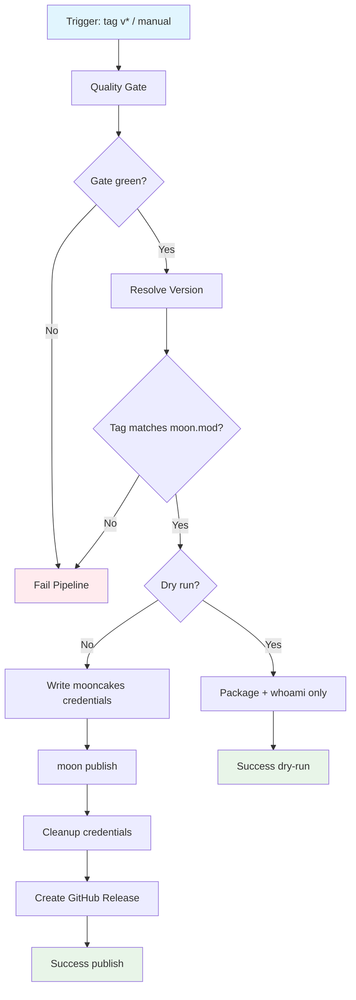

## Workflow Overview

**Purpose**: Publish a versioned `heyq02/moomem` module to mooncakes.io only after the full multi-target test gate passes, with tag↔manifest version alignment and credential hygiene.
**Trigger Events**: Push of version tag `v*`; manual `workflow_dispatch` (optional dry-run)
**Target Environments**: mooncakes.io registry; GitHub Releases (metadata/notes only)

## Execution Flow Diagram



## Jobs & Dependencies

| Job Name | Purpose | Dependencies | Execution Context |
|----------|---------|--------------|-------------------|
| quality | Reuse Test Pipeline (check + 4 targets + example smoke) | — | `workflow_call` → test-pipeline |
| release | Version assert → package/publish → GitHub Release | quality | Linux; mooncakes secret; no toolchain credential cache |

## Requirements Matrix

### Functional Requirements

| ID | Requirement | Priority | Acceptance Criteria |
|----|-------------|----------|-------------------|
| REQ-R01 | Gate publish on full test pipeline | High | Release job cannot start unless quality workflow succeeds |
| REQ-R02 | Align git tag with `moon.mod` version | High | Tag `vX.Y.Z` requires `version = "X.Y.Z"` |
| REQ-R03 | Publish module to mooncakes.io | High | `moon publish` exits 0; version appears on registry |
| REQ-R04 | Support dry-run without registry mutation | Medium | Manual dispatch `dry_run=true` skips publish |
| REQ-R05 | Create GitHub Release for tag publishes | Medium | Release notes for tag; skipped on dry-run |
| REQ-R06 | Fail on duplicate registry version | High | Non-zero exit; no partial GitHub Release after failed publish |

### Security Requirements

| ID | Requirement | Implementation Constraint |
|----|-------------|---------------------------|
| SEC-R01 | mooncakes auth via repository secret only | Secret `MOONCAKES_TOKEN` = full `credentials.json` body |
| SEC-R02 | Credentials never cached | Publish job disables `~/.moon` cache; always delete credentials file |
| SEC-R03 | Least privilege | `contents: read` for quality; `contents: write` only on release job for GitHub Release |
| SEC-R04 | No LLM / third-party deploy secrets | Publish path uses mooncakes only |

### Performance Requirements

| ID | Metric | Target | Measurement Method |
|----|-------|--------|-------------------|
| PERF-R01 | Release wall time (warm) | ≤ 25 min incl. quality | Workflow duration |
| PERF-R02 | Publish step alone | ≤ 5 min | Job step timing |

## Input/Output Contracts

### Inputs

```yaml
on:
  push:
    tags: ["v*"]          # e.g. v0.2.3 → moon.mod version 0.2.3
  workflow_dispatch:
    inputs:
      dry_run: boolean    # default false; package/whoami only when true

env:
  MOON_VERSION: string    # same pin as test pipeline
  MODULE_NAME: heyq02/moomem
```

### Outputs

```yaml
published_version: string     # X.Y.Z from moon.mod
mooncakes_url: string         # registry module URL (informational)
github_release_url: string    # when tag publish succeeds
```

### Secrets & Variables

| Type | Name | Purpose | Scope |
|------|------|---------|-------|
| Secret | MOONCAKES_TOKEN | Full `~/.moon/credentials.json` JSON | Repository / Environment |
| Variable | MOON_VERSION | Toolchain pin | Workflow env |

## Execution Constraints

### Runtime Constraints

- **Timeout**: Quality inherits test pipeline; release job ≤ 10 min
- **Concurrency**: One release at a time per ref; do not cancel in-flight publish (data safety)
- **Ordering**: Quality → version check → publish → GitHub Release (release only after registry success)

### Environmental Constraints

- **Runner**: Linux x64
- **Network**: mooncakes.io + toolchain/registry mirrors
- **Branch/tag**: Tag pushes preferred; manual dispatch allowed for retry/dry-run
- **Permissions**: Release job may write GitHub Releases only

## Error Handling Strategy

| Error Type | Response | Recovery Action |
|------------|----------|-----------------|
| Quality gate failure | Abort; no publish | Fix tests; re-tag or re-dispatch |
| Version mismatch tag↔mod | Abort | Fix `moon.mod` or retag |
| Missing `MOONCAKES_TOKEN` | Abort with setup hint | Add secret; re-run |
| Registry 409 duplicate | Abort | Bump version; new tag |
| Publish mid-fail | Abort; no GitHub Release | Inspect logs; retry dispatch |
| GitHub Release fail after publish | Pipeline red; package already on registry | Manually create release; do not re-publish same version |

## Quality Gates

| Gate | Criteria | Bypass Conditions |
|------|----------|-------------------|
| Test Pipeline | All jobs green | None |
| Version Alignment | Tag semver == `moon.mod` version | Manual dry-run may skip tag check |
| Auth | `moon whoami` succeeds | None for real publish |
| Registry accept | `moon publish` 2xx / success | None |

## Monitoring & Observability

### Key Metrics

- **Publish success rate** on tags
- **Time from tag push to registry availability**
- **Duplicate-version failure count** (process smell)

### Alerting

| Condition | Severity | Notification Target |
|-----------|----------|---------------------|
| Tag publish failed after green quality | High | Maintainers |
| Credentials missing | High | Repo admins |
| GitHub Release failed post-publish | Medium | Maintainers |

## Integration Points

### External Systems

| System | Integration Type | Data Exchange | SLA Requirements |
|--------|------------------|---------------|------------------|
| mooncakes.io | Publish API via `moon publish` | Packaged module zip | Auth token valid |
| GitHub Releases | API | Tag + notes | After registry success |
| Test Pipeline | `workflow_call` | Status only | Must complete green |

### Dependent Workflows

| Workflow | Relationship | Trigger Mechanism |
|----------|--------------|-------------------|
| Test Pipeline | Upstream gate | `workflow_call` from release |
| (future) docs deploy | Downstream optional | After successful release |

## Compliance & Governance

### Audit Requirements

- **Execution Logs**: Retain publish whoami username (not token)
- **Approval Gates**: Optional GitHub Environment `mooncakes` for manual approval
- **Change Control**: Spec → workflow PR → required review

### Security Controls

- **Access Control**: Only maintainers can add `MOONCAKES_TOKEN`
- **Secret Management**: Rotate mooncakes token on leak; never echo secret
- **Cache Policy**: Publish job must not persist credentials via actions cache

## Edge Cases & Exceptions

| Scenario | Expected Behavior | Validation Method |
|----------|-------------------|-------------------|
| Tag `v0.2.2` but mod `0.2.3` | Fail version gate | Unit script in workflow |
| Re-run publish same version | Registry conflict → fail | Observe non-zero |
| `dry_run=true` | No `moon publish`; no GitHub Release | Logs |
| Tag without `v` prefix | Not triggered by tag filter | Use `v*` only |
| Fork PR cannot publish | Secrets unavailable | Expected |

## Validation Criteria

- **VLD-R01**: Pushing `vX.Y.Z` with matching `moon.mod` and green tests publishes once
- **VLD-R02**: Mismatched tag/mod fails before credentials write
- **VLD-R03**: Absent secret fails with actionable message
- **VLD-R04**: Credentials file absent after job (`always` cleanup)
- **VLD-R05**: Dry-run never creates registry version or GitHub Release

## Change Management

1. Update this specification
2. Maintainer review
3. Change `.github/workflows/release-pipeline.yml` (+ test-pipeline `workflow_call` if needed)
4. Validate via `dry_run` dispatch
5. Publish via annotated tag `vX.Y.Z`

### Version History

| Version | Date | Changes | Author |
|---------|------|---------|--------|
| 1.0 | 2026-10-01 | Initial mooncakes release pipeline spec | DevOps / project |

## Related Specifications

- [Test Pipeline](./spec-process-cicd-test-pipeline.md)
- [Architecture](../docs/architecture.md)
- [README](../README.md)
- Implementation: [`.github/workflows/release-pipeline.yml`](../.github/workflows/release-pipeline.yml)
