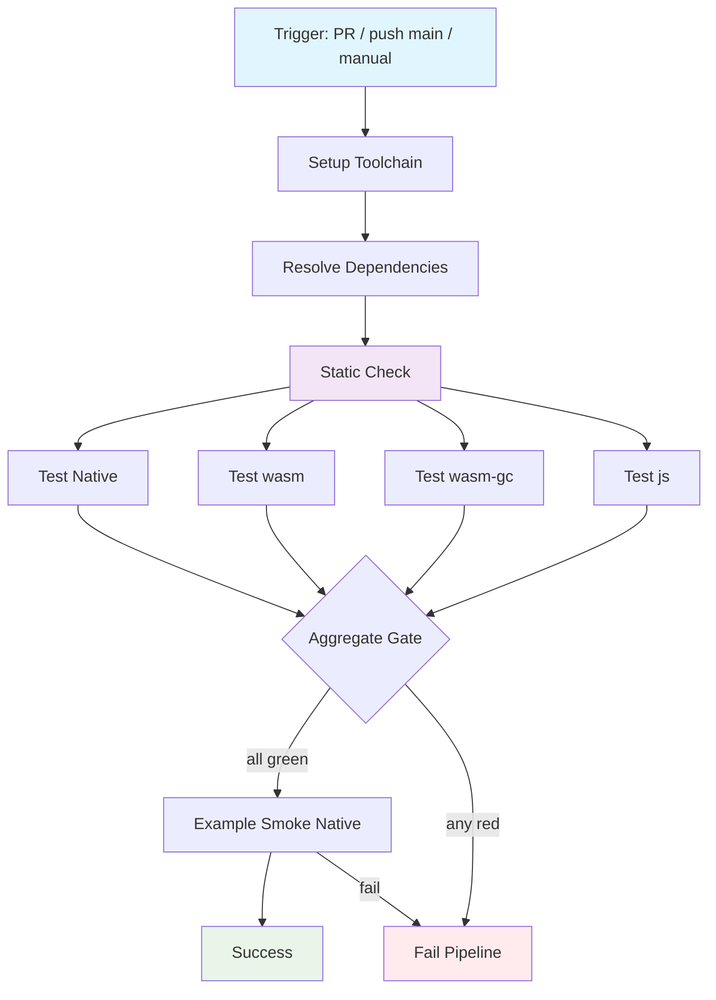

## Workflow Overview

**Purpose**: Gate every change with a zero-network, four-backend MoonBit regression suite covering core library, LLM adapter, CLI, and example smoke.
**Trigger Events**: Pull request (opened/synchronize/reopened); push to `main`; manual dispatch
**Target Environments**: Ephemeral CI runners; no staging/production deploy

## Execution Flow Diagram



## Jobs & Dependencies

| Job Name | Purpose | Dependencies | Execution Context |
|----------|---------|--------------|-------------------|
| setup | Install MoonBit toolchain; cache deps | — | Linux x64 runner |
| check | Typecheck / package lint across packages | setup | Same runner or matrix fan-out start |
| test-native | Full suite incl. FsBackend + CLI (expect ~97) | check | Linux; filesystem writable |
| test-wasm | Portable suite excl. native-only disk/CLI | check | Linux; wasm target |
| test-wasm-gc | Same as wasm for wasm-gc backend | check | Linux; wasm-gc target |
| test-js | Same as wasm for js backend | check | Linux; js target |
| smoke-example | Run `examples` with mock provider (zero network) | test-native | Linux; native |

**Parallelism**: `test-*` jobs run in parallel after `check`. `smoke-example` waits on `test-native` only (native binary + Fs path).

## Requirements Matrix

### Functional Requirements

| ID | Requirement | Priority | Acceptance Criteria |
|----|-------------|----------|-------------------|
| REQ-001 | Run static analysis before tests | High | Check job exits 0; no unresolved errors |
| REQ-002 | Execute native full regression | High | All packages green; count ≥ documented baseline (97) |
| REQ-003 | Execute wasm / wasm-gc / js regression | High | Each target green; native-only tests skipped via cfg |
| REQ-004 | Cover AC-01..AC-06 behaviors via existing black-box tests | High | Core e2e + persist + adversarial + llm_extractor + cli suites included |
| REQ-005 | Zero network / zero API Key | High | No outbound LLM calls; no secrets required for green path |
| REQ-006 | Smoke run examples on native | Medium | Example process exits 0 |
| REQ-007 | Fail closed on any job failure | High | Aggregate gate red if any matrix leg fails |
| REQ-008 | Surface per-target results in CI UI | Medium | Job names distinguish native / wasm / wasm-gc / js |

### Security Requirements

| ID | Requirement | Implementation Constraint |
|----|-------------|---------------------------|
| SEC-001 | No LLM API secrets in workflow | Tests use in-process mocks only |
| SEC-002 | Least privilege token | Default read permissions; no write/deploy tokens |
| SEC-003 | No credential persistence | Do not cache secrets; deps cache is public packages only |
| SEC-004 | Isolation regression remains gated | Adversarial / cross-user tests must run on every PR |

### Performance Requirements

| ID | Metric | Target | Measurement Method |
|----|-------|--------|-------------------|
| PERF-001 | End-to-end wall time | ≤ 15 min cold; ≤ 10 min warm cache | Workflow duration |
| PERF-002 | Single target test job | ≤ 5 min | Job duration |
| PERF-003 | Dependency restore | Cache hit preferred | Cache hit/miss annotation |

## Input/Output Contracts

### Inputs

```yaml
# Triggers
on:
  pull_request: { branches: [main] }
  push: { branches: [main] }
  workflow_dispatch: {}

# Path filters (optional optimize; default = whole repo)
paths_ignore: [docs/**, "**/*.mermaid", "**/*.md"]  # may include README if docs-only PR desired

# Environment Variables
MOON_VERSION: string   # Purpose: pin toolchain; match README floor (≥ 0.1.20260920)
CI: "true"             # Purpose: mark non-interactive

# No repository secrets required for the green path
```

### Outputs

```yaml
# Implicit job status only (no deploy artifacts required)
check_status: boolean
test_native_status: boolean
test_wasm_status: boolean
test_wasm_gc_status: boolean
test_js_status: boolean
smoke_example_status: boolean

# Optional annotations
test_counts: string  # e.g. native=97 passed
```

### Secrets & Variables

| Type | Name | Purpose | Scope |
|------|------|---------|-------|
| Variable | MOON_VERSION | Pin toolchain release | Repository / Workflow |
| — | — | No secrets for default path | — |

## Execution Constraints

### Runtime Constraints

- **Timeout**: Workflow 20 min; per job 8 min
- **Concurrency**: One active run per PR ref; cancel superseded runs on new push
- **Resource Limits**: Standard 2-core runner sufficient; writable `/tmp` for FsBackend tests

### Environmental Constraints

- **Runner Requirements**: Linux x64; toolchain installer available; no GPU
- **Network Access**: Fetch MoonBit toolchain + mooncakes deps (`moonbitlang/x`, `mizchi/llm`); no LLM endpoints
- **Permissions**: `contents: read` only
- **Filesystem**: Native persist tests create/remove temp dirs under workspace; must cleanup or ignore in artifacts

## Error Handling Strategy

| Error Type | Response | Recovery Action |
|------------|----------|-----------------|
| Toolchain install failure | Fail setup | Retry once; then block merge |
| Dependency resolve failure | Fail setup | Clear cache + retry once |
| Static check failure | Fail check; skip optional smoke | Fix code; no bypass on main |
| Test failure (any target) | Fail that job; aggregate red | Fix failing suite; re-run workflow |
| Flaky disk race (native) | Fail | Prefer MemoryBackend crash tests; retry job once max |
| Example smoke failure | Fail pipeline | Fix examples or mock contract |
| Cache corruption | Restore miss | Bypass cache; full download |

## Quality Gates

### Gate Definitions

| Gate | Criteria | Bypass Conditions |
|------|----------|-------------------|
| Static Check | Zero errors (warnings may be allowed if policy set) | None on `main` / PR |
| Native Suite | 100% pass; includes FsBackend + CLI | None |
| Multi-target Suite | wasm + wasm-gc + js all pass | None (AC-06) |
| Zero-network | No secret injection; tests offline | None |
| Example Smoke | Native example exits 0 | Docs-only path-filter PRs may skip if paths_ignore applied |

### Coverage Map (behavioral, not line %)

| Area | Packages / Suites | Targets |
|------|-------------------|---------|
| Types / codec / user_id | `src` unit black-box | all |
| Index / RRF / isolation | `src` index + e2e + qa adversarial | all |
| Persist / crash recovery | MemoryBackend all; FsBackend native-only | all / native |
| Store e2e AC-01..05 | `store_e2e_test` | all |
| LLM extractor / judge (AC-03) | `src/llm_extractor` mock tests | all |
| W2 adversarial | `qa_w2_adversarial_test` | all |
| CLI | `src/cli` | native |
| Example | `examples` smoke | native |

## Monitoring & Observability

### Key Metrics

- **Success Rate**: ≥ 95% on `main` over rolling 30 days
- **Execution Time**: Track p50 / p95 wall time
- **Resource Usage**: Runner minutes per week

### Alerting

| Condition | Severity | Notification Target |
|-----------|----------|---------------------|
| `main` pipeline red | High | PR author + default watchers via GitHub |
| Flake > 2 retries / week same test | Medium | Maintainers |
| Toolchain pin incompatible | High | Maintainers |

## Integration Points

### External Systems

| System | Integration Type | Data Exchange | SLA Requirements |
|--------|------------------|---------------|------------------|
| MoonBit toolchain registry | Download | Installer / binary | Must be reachable at job start |
| mooncakes deps | Download | `moonbitlang/x`, `mizchi/llm` | Version pins in module manifest |
| GitHub Checks API | Status | Pass/fail per job | Blocks PR merge when required |

### Dependent Workflows

| Workflow | Relationship | Trigger Mechanism |
|----------|--------------|-------------------|
| (future) release / publish | Downstream | Only after this pipeline green on tag |
| (future) security scan | Sibling | Independent; not required for v0.1 gate |

## Compliance & Governance

### Audit Requirements

- **Execution Logs**: Retain per GitHub org default (≥ 90 days recommended)
- **Approval Gates**: None for test-only workflow
- **Change Control**: Spec update → review → workflow change → validate on PR

### Security Controls

- **Access Control**: Workflow editable by maintainers; forks get read-only secrets (none needed)
- **Secret Management**: N/A for green path
- **Vulnerability Scanning**: Out of scope for this workflow

## Edge Cases & Exceptions

### Scenario Matrix

| Scenario | Expected Behavior | Validation Method |
|----------|-------------------|-------------------|
| Docs-only PR | Optional skip via path filter; or full run if filter unused | Path filter config |
| Native-only test fails on wasm job | Must not appear; cfg-gated | Confirm wasm count < native |
| Toolchain newer than pin | Use pin; do not float | MOON_VERSION check |
| Concurrent pushes to same PR | Cancel previous run | Concurrency group |
| Temp persist dirs left behind | Ignore in VCS; cleanup in test | `.gitignore` + test cleanup |
| Dependency yank / registry outage | Fail with clear setup error | Logs show resolve step |

## Validation Criteria

### Workflow Validation

- **VLD-001**: Fresh PR with no code defects produces all-green checks
- **VLD-002**: Intentionally broken unit test fails the matching target job and blocks merge
- **VLD-003**: Pipeline completes without LLM secrets configured
- **VLD-004**: Native job exercises FsBackend reopen / truncate recovery tests
- **VLD-005**: wasm / wasm-gc / js jobs complete without native-only failures
- **VLD-006**: Example smoke runs after native tests pass

### Performance Benchmarks

- **PERF-001**: Cold run ≤ 15 minutes
- **PERF-002**: Warm cache run ≤ 10 minutes
- **PERF-003**: No job exceeds 8-minute timeout under normal load

## Change Management

### Update Process

1. **Specification Update**: Modify this document first
2. **Review & Approval**: Maintainer review on PR
3. **Implementation**: Apply changes to `.github/workflows/` (out of scope of this doc)
4. **Testing**: Open draft PR exercising matrix
5. **Deployment**: Merge to `main`; mark checks required in branch protection

### Version History

| Version | Date | Changes | Author |
|---------|------|---------|--------|
| 1.0 | 2026-10-01 | Initial specification: four-target test gate + example smoke | DevOps / project |

## Related Specifications

- [Architecture](../docs/architecture.md) — AC/FR mapping, backend matrix, test principles
- [README](../README.md) — local commands, expected test counts, toolchain floor
- Sequence / class diagrams under `docs/` — behavioral reference for e2e expectations
- Implementation: [`.github/workflows/test-pipeline.yml`](../.github/workflows/test-pipeline.yml) + [`.github/actions/setup-moonbit`](../.github/actions/setup-moonbit/action.yml)
